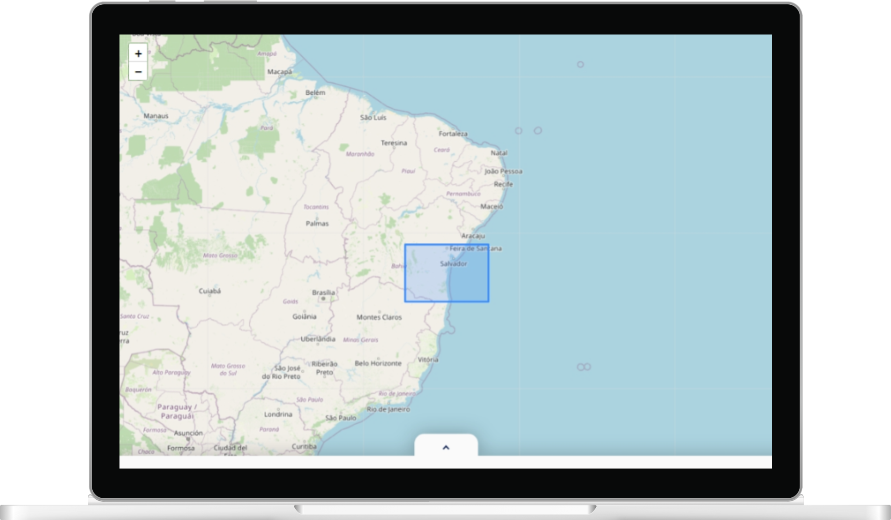
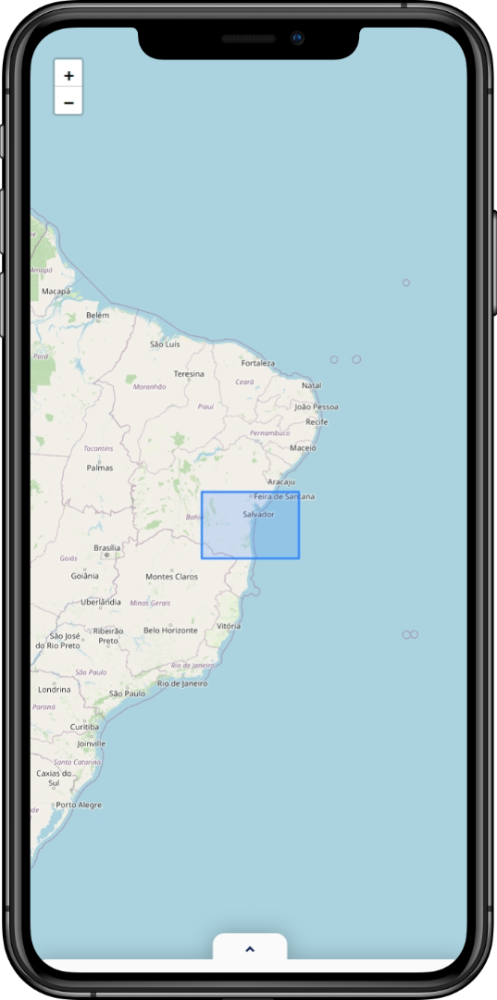

<br/>

<p align=center>
    
</p>

<h1 align=center>Carta Topográfica</h1>

<p align=center>
    <a href='https://carta-topografica.vercel.app/'>carta-topografica.vercel.app</a>
    <br/><br/>
    
    &nbsp;
    
    &nbsp;
    
    &nbsp;
    
</p>

&nbsp;

<p align=center>
    
    &nbsp;&nbsp;&nbsp;&nbsp;
    
</p>

&nbsp;

## 💡 Motivation

This project aims to display the different map projections of the systematic topographic mapping of Brazil.

"Cartas Topográficas" are detailed maps that show the physical characteristics of an area, including elevation, terrain, and human-made features.

They are crucial for navigation, planning, and analyzing geographical landscapes due to their accuracy in representing natural and artificial elements such as mountains, rivers, roads, and settlements.

&nbsp;

## 🗺 Map

This project uses [Leaflet](https://leafletjs.com/) map JS library to render the world map with simplicity, performance and usability.

> [View repository](https://github.com/Leaflet/Leaflet)  

&nbsp;

## 🖥️ Running the project

Install the dependencies:

```bash
npm install
```

Run the app locally:

```bash
npm run dev
```
